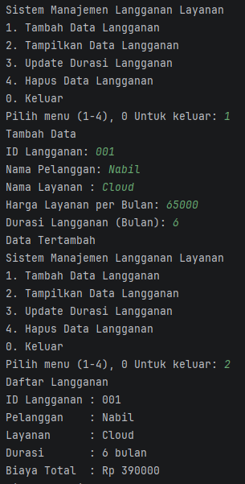

# Sistem Manajemen Langganan Layanan

> **Nama:** Muhammad Nabil Rahmatullah
>
> **Mata Kuliah:** Pemrograman Berbasis Objek
>
> **Bahasa Pemrograman:** Java

---

## Daftar Isi

1. [Deskripsi Proyek](#deskripsi-proyek)
2. [Struktur Proyek](#struktur-proyek)
3. [Arsitektur & Desain OOP](#arsitektur--desain-oop)
4. [Penjelasan Kelas](#penjelasan-kelas)
5. [Fitur Aplikasi](#fitur-aplikasi)
6. [Alur Program](#alur-program)
7. [Cara Menjalankan](#cara-menjalankan)
8. [Contoh Penggunaan](#contoh-penggunaan)

---

## Deskripsi Proyek

Proyek ini merupakan **Sistem Manajemen Langganan Layanan** berbasis konsol (CLI) yang dibangun menggunakan Java. Aplikasi ini memungkinkan pengguna untuk mengelola data langganan layanan secara lengkap mulai dari menambah, menampilkan, memperbarui, hingga menghapus data langganan.

Proyek ini dibuat sebagai bagian dari praktikum **Post-Test 1** mata kuliah Pemrograman Berorientasi Objek, dengan fokus pada penerapan konsep dasar OOP seperti **enkapsulasi**, **komposisi objek**, dan **modularisasi kode**.

---

## Struktur Proyek

```
POSTTEST_1/
├── src/
│   └── com/
│       └── manajemen/
│           ├── aplikasi/
│           │   └── Main.java          # File Main
│           └── core/
│               ├── Pelanggan.java     # Class Pelanggan
│               ├── Layanan.java       # Class Layanan
│               └── Langganan.java     # Class Langganan
├── .idea/                             
├── untitled.iml                       
├── .gitignore
└── README.md
```

---

## OOP

Proyek ini menerapkan prinsip-prinsip OOP sebagai berikut:

### Enkapsulasi
Setiap kelas menggunakan modifier `private` pada atributnya dan menyediakan akses melalui method `getter` dan `setter`. Contohnya pada kelas `Layanan`, setter `setHarga()` dilengkapi validasi agar harga tidak bisa bernilai negatif.

### Komposisi Objek
Kelas `Langganan` menggunakan komposisi ia "memiliki" objek `Pelanggan` dan `Layanan` sebagai atributnya, bukan mewarisi dari keduanya. Ini merupakan pendekatan *has-a relationship* yang tepat dalam desain OOP.

### Package
- Package `com.manajemen.core` bertanggung jawab atas entitas data.
- Package `com.manajemen.aplikasi` bertanggung jawab atas logika aplikasi dan interaksi pengguna.

---

## Penjelasan Kelas

### 1. `Pelanggan.java`
Merepresentasikan data pelanggan yang berlangganan layanan.

| Atribut | Tipe | Keterangan |
|---|---|---|
| `idPelanggan` | `String` | ID unik pelanggan (format: `IDP-xxx`) |
| `nama` | `String` | Nama lengkap pelanggan |

### 2. `Layanan.java`
Merepresentasikan layanan/produk yang tersedia untuk dilanggan.

| Atribut | Tipe | Keterangan |
|---|---|---|
| `idLayanan` | `String` | ID unik layanan (format: `IDS-xxx`) |
| `namaLayanan` | `String` | Nama layanan |
| `harga` | `int` | Harga langganan per bulan (Rupiah) |

> **Validasi:** Setter `setHarga()` memastikan harga tidak bisa bernilai di bawah 0.

### 3. `Langganan.java`
Merupakan kelas utama yang menghubungkan `Pelanggan` dan `Layanan` dalam satu entitas langganan.

| Atribut | Tipe | Keterangan |
|---|---|---|
| `idLangganan` | `String` | ID unik langganan |
| `pelanggan` | `Pelanggan` | Objek pelanggan (komposisi) |
| `layanan` | `Layanan` | Objek layanan (komposisi) |
| `durasiBulan` | `int` | Durasi berlangganan dalam bulan |

**Method penting:**
```java
public int totalBiaya() {
    return layanan.getHarga() * durasiBulan;
}
```
Method `totalBiaya()` menghitung total biaya yang harus dibayar berdasarkan harga layanan dikalikan durasi.

### 4. `Main.java`
Kelas utama yang menjalankan program. Berisi:
- Loop menu utama (while loop)
- `ArrayList<Langganan>` sebagai penyimpanan data sementara (in-memory)
- Empat operasi CRUD: `createData()`, `readData()`, `updateData()`, `deleteData()`

---

## Fitur Aplikasi

| No | Fitur | Deskripsi |
|---|---|---|
| 1 | **Tambah Data Langganan** | Input data pelanggan, layanan, harga, dan durasi |
| 2 | **Tampilkan Data Langganan** | Menampilkan seluruh daftar langganan beserta total biaya |
| 3 | **Update Durasi Langganan** | Mengubah durasi berlangganan berdasarkan ID |
| 4 | **Hapus Data Langganan** | Menghapus data langganan berdasarkan ID |
| 0 | **Keluar** | Mengakhiri program |

---

## Alur Program

```
[Mulai]
    |
    v
[Tampilkan Menu Utama]
    |
    ├── [1] Tambah → Input ID, Nama Pelanggan, Nama Layanan, Harga, Durasi → Simpan ke ArrayList
    |
    ├── [2] Tampilkan → Iterasi ArrayList → Cetak semua data + total biaya
    |
    ├── [3] Update → Input ID → Cari di ArrayList → Update durasi bulan
    |
    ├── [4] Hapus → Input ID → Cari di ArrayList → Hapus elemen
    |
    └── [0] Keluar → Akhiri program
```

---

## Cara Menjalankan

### Prasyarat
- **Java JDK 8** atau lebih baru sudah terinstal
- IDE yang direkomendasikan **IntelliJ IDEA**

### Langkah-langkah

**Menggunakan IntelliJ IDEA:**
1. Buka IntelliJ IDEA, pilih `File > Open` dan arahkan ke folder `POSTTEST_1`
2. Pastikan folder `src` sudah ditandai sebagai *Sources Root*
3. Jalankan file `Main.java` dengan klik kanan → `Run 'Main'`

**Menggunakan Command Line:**
```bash
# Masuk ke direktori proyek
cd POSTTEST_1

# Kompilasi semua file Java
javac -d out src/com/manajemen/core/*.java src/com/manajemen/aplikasi/Main.java

# Jalankan program
java -cp out com.manajemen.aplikasi.Main
```

---

## Contoh Penggunaan

```
Sistem Manajemen Langganan Layanan
1. Tambah Data Langganan
2. Tampilkan Data Langganan
3. Update Durasi Langganan
4. Hapus Data Langganan
0. Keluar
Pilih menu (1-4), 0 Untuk keluar: 1

Tambah Data
ID Langganan: 001
Nama Pelanggan: Nabil
Nama Layanan : Cloud
Harga Layanan per Bulan: 65000
Durasi Langganan (Bulan): 6
Data Tertambah

Pilih menu (1-4), 0 Untuk keluar: 2

Daftar Langganan
ID Langganan : 001
Pelanggan    : Nabil
Layanan      : Cloud
Durasi       : 6 bulan
Biaya Total  : Rp 390000
```


---

## Contoh Screenshot Output

